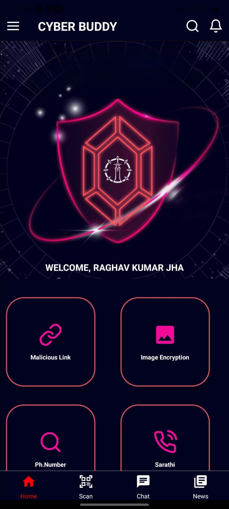
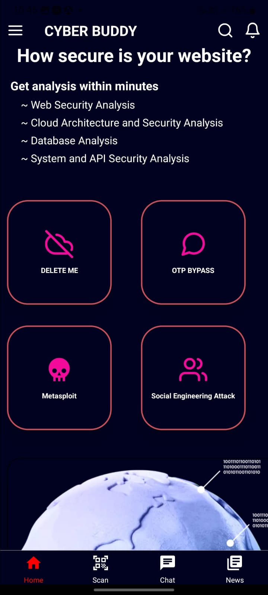
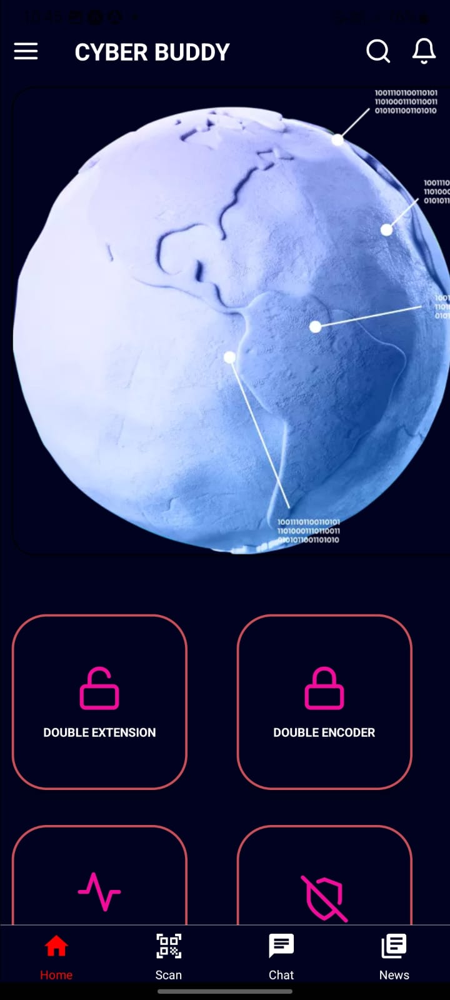
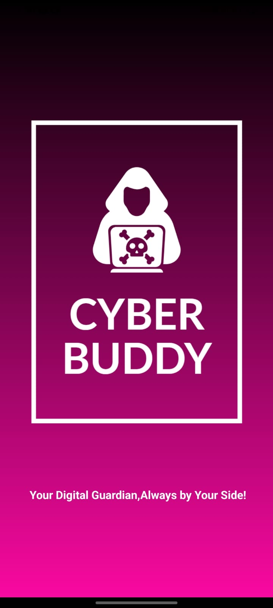

<h1 align="center">:octocat: CyberBuddy App :octocat:</h1>

## Table of Contents

- [Table of Contents](#table-of-contents)
- [Introduction](#introduction)
- [Features](#features)
- [Requirements](#requirements)
- [How To Run](#how-to-run)
- [Screenshoot](#screenshoot)
- [Contributors](#contributors)

## Introduction
A crossword is a word puzzle that usually takes the form of a square or a rectangular grid of white-and black-shaded squares. The game's goal is to fill the white squares with letters, forming words or phrases, by solving clues, which lead to the answers.


## Features
* User can login/register to start the game
* User can view completed and incompleted game in dashboard
* User get one clue when they start the game.

## Requirements
* [`npm`](https://www.npmjs.com/get-npm)
* [`react native`](https://facebook.github.io/react-native)
* [`redux`](https://redux.js.org/)
* [`react navigation`](https://reactnavigation.org/)
* [`API Data`](https://github.com/ihsaninh/crossword-api)


## How To Run

1. Clone this repository
   ```
   $ git clone https://github.com/ihsaninh/CrossWords-React-Native.git
   ```
2. Install all depedencies on the package.json
   ```
   $ cd CrossWords-React-Native
   $ npm install
   ```
3. Run Application
   ```
   $ react-native start
   $ react-native run-android or react-native run-ios
   ```
## Screenshoot
<div align="center">
      
     
        
    
       

</div>


## Contributors
<center>
  <table>
    <tr>
      <td align="center">
        <a href="https://github.com/raghav029">
          <br/>
          <sub><b>RAGHAV KUMAR JHA</b></sub>
        </a>
      </td>
      <td align="center">
        <a href="https://github.com/jitendriyadeep">
          <br/>
          <sub><b>JITENDRIYA DEEP</b></sub>
        </a>
      </td>
       <td align="center">
        <a href="https://github.com/loki2107">
          <br/>
          <sub><b>LOKESH E</b></sub>
        </a>
      </td>
      <td align="center">
        <a href="https://github.com/Sammy-100">
          <br/>
          <sub><b>SAMIKSHA </b></sub>
        </a>
      </td>
    </tr>
  </table>
</center>
